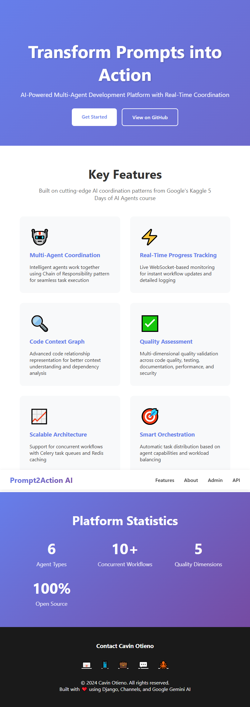
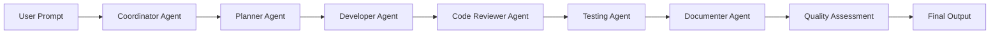

# Prompt2Action AI - Multi-Agent Development Platform

<div align="center">


**Transform prompts into action with AI-powered multi-agent coordination**

🚀 **[LIVE DEMO](https://prompt2action-ai-production.up.railway.app)** • 🔐 **[Admin Panel](https://prompt2action-ai-production.up.railway.app/admin)** • 📖 **[Documentation](#-documentation)** • ⚡ **[Quick Start](#-installation)** 

</div>

---

## 🌐 **LIVE DEMO ACCESS**

<div align="center">

[](https://prompt2action-ai-production.up.railway.app)
[](https://prompt2action-ai-production.up.railway.app/admin)

**Application**: https://prompt2action-ai-production.up.railway.app  
**Admin Access**: https://prompt2action-ai-production.up.railway.app/admin  
**Login**: `admin` / `admin`  
**Status**: ✅ **ACTIVE** & **DEPLOYED**

</div>

---

### 📸 **Application Screenshots**

**Homepage Preview:**
<!-- To add a screenshot, save it as `docs/screenshots/homepage.png` and uncomment the line below -->
<!--  -->
*To add a screenshot: Visit the live demo, take a screenshot, and save it as `docs/screenshots/homepage.png`*

**Admin Panel Preview:**
<!-- To add admin panel screenshot, save it as `docs/screenshots/admin-panel.png` and uncomment the line below -->
<!--  -->
*Admin panel available at `/admin` with full workflow management capabilities*

---

## 🎯 **Quick Start**

Want to try it immediately? Visit the **[Live Demo](https://prompt2action-ai-production.up.railway.app)** or set up locally:

```bash
# Clone the repository
git clone https://github.com/OumaCavin/prompt2action-ai.git
cd prompt2action-ai

# Install dependencies
pip install -r requirements.txt

# Run the development server
python manage.py runserver

# Visit http://localhost:8000
```

**Admin Panel**: `http://localhost:8000/admin` (create superuser with `python manage.py createsuperuser`)

---

### 🚀 **Key Features Available in Live Demo**

- ✅ **Multi-Agent Coordination** - Planner, Developer, Reviewer, Tester, Documenter
- ✅ **Real-Time Progress Tracking** - Live WebSocket updates
- ✅ **Workflow Management** - Create and monitor AI workflows
- ✅ **Code Context Graph** - Advanced code analysis
- ✅ **Quality Assessment** - Multi-dimensional validation
- ✅ **Admin Dashboard** - Full platform management

---

## 📋 Table of Contents

- [Overview](#-overview)
- [Key Features](#-key-features)
- [Key Innovations](#-key-innovations)
- [Architecture](#-architecture)
- [Technology Stack](#-technology-stack)
- [Installation](#-installation)
- [Configuration](#-configuration)
- [Usage](#-usage)
- [API Documentation](#-api-documentation)
- [Deployment](#-deployment)
- [Testing](#-testing)
- [Contributing](#-contributing)
- [License](#-license)
- [Contact](#-contact)

---

## 📋 Table of Contents

- [Overview](#-overview)
- [Key Features](#-key-features)
- [Key Innovations](#-key-innovations)
- [Architecture](#-architecture)
- [Technology Stack](#-technology-stack)
- [Installation](#-installation)
- [Configuration](#-configuration)
- [Usage](#-usage)
- [API Documentation](#-api-documentation)
- [Deployment](#-deployment)
- [Testing](#-testing)
- [Contributing](#-contributing)
- [License](#-license)
- [Contact](#-contact)

---

## 🌟 Overview

**Prompt2Action AI** is an advanced multi-agent AI development platform that transforms natural language prompts into coordinated actions through intelligent agent orchestration. Built on the foundation of the Kaggle 5 Days of AI Agents course, this platform implements cutting-edge AI coordination patterns and provides real-time workflow monitoring.

### What Makes It Special?

- **Multi-Agent Coordination**: Intelligent agents work together using Chain of Responsibility pattern
- **Real-Time Progress Tracking**: Live WebSocket-based workflow monitoring  
- **Code Context Graph (CCG)**: Advanced code relationship representation
- **Quality Assessment**: Multi-dimensional quality validation
- **Scalable Architecture**: Supports concurrent workflow execution

---

## ✨ Key Features

### Core Capabilities

1. **Intelligent Agent Orchestration**
   - Planner, Developer, Reviewer, Tester, and Documenter agents
   - Automatic task distribution based on agent capabilities
   - Chain of Responsibility pattern for seamless coordination

2. **Real-Time Workflow Monitoring**
   - Live progress updates via WebSockets
   - Detailed logging at every step
   - Visual progress dashboards

3. **Code Context Graph (CCG)**
   - Advanced code relationship mapping
   - Dependency analysis
   - Complexity metrics

4. **Quality Assessment Engine**
   - Code quality scoring
   - Test coverage analysis
   - Documentation completeness
   - Performance benchmarking
   - Security validation

5. **Scalable Workflow Management**
   - Support for concurrent workflows
   - Task queuing with Celery
   - Redis-based caching

---

## 🚀 Key Innovations

### 1. Chain of Responsibility Pattern
Elegant multi-agent coordination where each agent handles specific responsibilities and passes work to the next appropriate agent.

```python
Coordinator → Planner → Developer → Reviewer → Tester → Documenter
```

### 2. Code Context Graph (CCG)
Advanced code relationship representation that provides deep understanding of code structure and dependencies.

```json
{
  "nodes": [
    {"id": "class_UserModel", "type": "class", "complexity": 12},
    {"id": "func_authenticate", "type": "function", "complexity": 5}
  ],
  "edges": [
    {"from": "class_UserModel", "to": "func_authenticate", "type": "calls"}
  ]
}
```

### 3. Real-Time Progress Tracking
Live workflow monitoring with WebSocket connections for instant updates.

### 4. Multi-Dimensional Quality Assessment
Comprehensive quality validation across multiple dimensions:
- Code Quality (25%)
- Test Coverage (20%)
- Documentation (15%)
- Performance (20%)
- Security (20%)

### 5. Scalable Architecture
Built for enterprise-scale concurrent workflow processing with Redis and Celery.

---

## 🏗️ Architecture

### System Architecture

```
┌─────────────────────────────────────────────────────────────┐
│                        Client Layer                          │
│  (React/Vue Frontend, Mobile Apps, CLI Tools)               │
└────────────────────┬────────────────────────────────────────┘
                     │
┌────────────────────┴────────────────────────────────────────┐
│                     API Gateway Layer                        │
│         (Django REST Framework + WebSockets)                 │
└────────────────────┬────────────────────────────────────────┘
                     │
┌────────────────────┴────────────────────────────────────────┐
│                 Multi-Agent Orchestration                    │
│   ┌──────────┐  ┌──────────┐  ┌──────────┐  ┌──────────┐  │
│   │ Planner  │→ │Developer │→ │ Reviewer │→ │  Tester  │  │
│   └──────────┘  └──────────┘  └──────────┘  └──────────┘  │
│              ↓                                               │
│           Coordinator Agent (Chain of Responsibility)        │
└────────────────────┬────────────────────────────────────────┘
                     │
┌────────────────────┴────────────────────────────────────────┐
│                    Core Services Layer                       │
│  ┌─────────────┐ ┌──────────────┐ ┌────────────────────┐  │
│  │  Workflow   │ │ CCG Analysis │ │ Quality Assessment │  │
│  │  Engine     │ │   Service    │ │      Service       │  │
│  └─────────────┘ └──────────────┘ └────────────────────┘  │
└────────────────────┬────────────────────────────────────────┘
                     │
┌────────────────────┴────────────────────────────────────────┐
│                    Data & Cache Layer                        │
│    ┌──────────┐     ┌───────┐     ┌──────────────┐         │
│    │PostgreSQL│     │ Redis │     │  Celery      │         │
│    │  (DB)    │     │(Cache)│     │  (Tasks)     │         │
│    └──────────┘     └───────┘     └──────────────┘         │
└─────────────────────────────────────────────────────────────┘
```

### Agent Coordination Flow



### Code Context Graph Structure

```
Module A ──calls──> Function X
    │                   │
inherits            returns
    │                   │
    ↓                   ↓
Class B ──uses──> Type Y
```

---

## 💻 Technology Stack

### Backend
- **Framework**: Django 5.2.8
- **API**: Django REST Framework 3.16.1
- **Real-time**: Django Channels 4.3.1
- **Task Queue**: Celery 5.5.3
- **Cache**: Redis 7.0.1
- **Database**: SQLite (Dev) / PostgreSQL (Production)

### AI & ML
- **AI Engine**: Google Gemini API
- **Agent Framework**: Custom implementation

### Frontend
- **Framework**: HTML5, CSS3, Vanilla JavaScript
- **Real-time**: WebSocket API
- **UI Components**: Custom responsive components

### DevOps
- **Containerization**: Docker (recommended)
- **Server**: Daphne (ASGI)
- **Version Control**: Git

---

## 📦 Installation

### Prerequisites

- Python 3.12+
- Git
- Redis (for Celery and Channels)
- Node.js 16+ (optional, for frontend development)

### Step 1: Clone the Repository

```bash
git clone https://github.com/OumaCavin/prompt2action-ai.git
cd prompt2action-ai
```

### Step 2: Create Virtual Environment

```bash
python -m venv venv
source venv/bin/activate  # On Windows: venv\Scripts\activate
```

### Step 3: Install Dependencies

```bash
pip install -r requirements.txt
```

### Step 4: Environment Configuration

Create a `.env` file in the project root:

```bash
cp .env.example .env
```

Edit `.env` with your configuration:

```env
# Django Configuration
DJANGO_SECRET_KEY=your-secret-key-here
DEBUG=True
ALLOWED_HOSTS=localhost,127.0.0.1

# Google Gemini API
GEMINI_API_KEY=your-gemini-api-key-here

# Email Configuration
EMAIL_HOST_PASSWORD=your-app-password-here

# Redis Configuration
CELERY_BROKER_URL=redis://localhost:6379/0
```

### Step 5: Database Setup

```bash
python manage.py makemigrations
python manage.py migrate
```

### Step 6: Create Superuser

```bash
python manage.py createsuperuser
```

### Step 7: Collect Static Files

```bash
python manage.py collectstatic --noinput
```

### Step 8: Run Development Server

```bash
# Terminal 1: Django Server
python manage.py runserver

# Terminal 2: Celery Worker (optional)
celery -A config worker -l info

# Terminal 3: Redis Server (if not running as service)
redis-server
```

Visit `http://localhost:8000` in your browser.

---

## ⚙️ Configuration

### Environment Variables

| Variable | Description | Default |
|----------|-------------|---------|
| `DJANGO_SECRET_KEY` | Django secret key | Random key |
| `DEBUG` | Debug mode | True |
| `ALLOWED_HOSTS` | Allowed hosts | localhost,127.0.0.1 |
| `GEMINI_API_KEY` | Google Gemini API key | Required |
| `EMAIL_HOST_PASSWORD` | Email password | Required |
| `CELERY_BROKER_URL` | Celery broker URL | redis://localhost:6379/0 |

### Agent Configuration

Edit `config/settings.py`:

```python
AGENT_SETTINGS = {
    'MAX_CONCURRENT_WORKFLOWS': 10,
    'WORKFLOW_TIMEOUT': 3600,  # 1 hour
    'MAX_RETRIES': 3,
    'RETRY_DELAY': 5,  # seconds
}
```

---

## 🎯 Usage

### Creating a Workflow

```python
from agents.models import Agent, Workflow, Task

# Create agents
planner = Agent.objects.create(
    name="Planning Agent",
    agent_type="PLANNER",
    description="Plans and structures development tasks"
)

# Create workflow
workflow = Workflow.objects.create(
    title="Build REST API",
    description="Create a RESTful API for user management",
    prompt="Build a Django REST API with user authentication",
    user=request.user
)

# Assign agents
workflow.assigned_agents.add(planner)
workflow.start()
```

### Real-Time Monitoring (WebSocket)

```javascript
const ws = new WebSocket('ws://localhost:8000/ws/workflow/123/');

ws.onmessage = function(event) {
    const data = JSON.parse(event.data);
    console.log('Progress update:', data);
};
```

---

## 📚 API Documentation

### REST Endpoints

#### Workflows

```http
GET    /api/workflows/          # List all workflows
POST   /api/workflows/          # Create workflow
GET    /api/workflows/{id}/     # Get workflow details
PUT    /api/workflows/{id}/     # Update workflow
DELETE /api/workflows/{id}/     # Delete workflow
```

#### Agents

```http
GET    /api/agents/             # List all agents
POST   /api/agents/             # Create agent
GET    /api/agents/{id}/        # Get agent details
```

#### Tasks

```http
GET    /api/tasks/              # List all tasks
GET    /api/tasks/{id}/         # Get task details
```

### WebSocket Endpoints

```
ws://localhost:8000/ws/workflow/{workflow_id}/    # Workflow progress
ws://localhost:8000/ws/progress/                  # Global progress
```

---

## 🚀 Deployment

### Recommended Cloud Platforms

#### 1. **Railway** (Recommended for Free Tier)

**Why Railway?**
- Free tier available
- Automatic deployment from GitHub
- Built-in PostgreSQL and Redis
- Easy environment variable management

**Steps:**

1. Create Railway account at [railway.app](https://railway.app)
2. Connect your GitHub repository
3. Add PostgreSQL and Redis services
4. Configure environment variables:
   ```
   DJANGO_SECRET_KEY
   GEMINI_API_KEY
   EMAIL_HOST_PASSWORD
   DATABASE_URL (auto-configured)
   REDIS_URL (auto-configured)
   ```
5. Deploy automatically on git push

#### 2. **Heroku**

**Prerequisites:**
- Heroku account
- Heroku CLI installed

**Steps:**

```bash
# Install Heroku CLI
curl https://cli-assets.heroku.com/install.sh | sh

# Login to Heroku
heroku login

# Create app
heroku create prompt2action-ai

# Add PostgreSQL
heroku addons:create heroku-postgresql:hobby-dev

# Add Redis
heroku addons:create heroku-redis:hobby-dev

# Set environment variables
heroku config:set DJANGO_SECRET_KEY=your-secret-key
heroku config:set GEMINI_API_KEY=your-api-key
heroku config:set EMAIL_HOST_PASSWORD=your-password

# Deploy
git push heroku main

# Run migrations
heroku run python manage.py migrate

# Create superuser
heroku run python manage.py createsuperuser
```

#### 3. **DigitalOcean App Platform**

1. Connect GitHub repository
2. Configure build and run commands:
   - Build: `pip install -r requirements.txt`
   - Run: `daphne -b 0.0.0.0 -p $PORT config.asgi:application`
3. Add PostgreSQL and Redis managed databases
4. Set environment variables in app settings

#### 4. **AWS Elastic Beanstalk**

```bash
# Install EB CLI
pip install awsebcli

# Initialize
eb init -p python-3.12 prompt2action-ai

# Create environment
eb create prompt2action-env

# Set environment variables
eb setenv DJANGO_SECRET_KEY=your-key GEMINI_API_KEY=your-key

# Deploy
eb deploy
```

### Docker Deployment

```bash
# Build image
docker build -t prompt2action-ai .

# Run container
docker run -p 8000:8000 \
  -e GEMINI_API_KEY=your-key \
  -e DATABASE_URL=your-db-url \
  prompt2action-ai
```

---

## 🧪 Testing

```bash
# Run all tests
python manage.py test

# Run specific app tests
python manage.py test agents

# Run with coverage
coverage run --source='.' manage.py test
coverage report
```

---

## 📖 Documentation

### Architecture Diagrams

See `docs/architecture/` for detailed architecture diagrams including:
- System architecture
- Database schema
- Agent coordination flow
- Deployment architecture

### API Documentation

Full API documentation available at `/api/docs/` when running the server.

---

## 🤝 Contributing

Contributions are welcome! Please follow these steps:

1. Fork the repository
2. Create a feature branch (`git checkout -b feature/AmazingFeature`)
3. Commit your changes (`git commit -m 'Add some AmazingFeature'`)
4. Push to the branch (`git push origin feature/AmazingFeature`)
5. Open a Pull Request

---

## 📄 License

This project is licensed under the MIT License - see the [LICENSE](LICENSE) file for details.

---

## 📧 Contact

**Cavin Otieno**

- 📧 Email: [cavin.otieno012@gmail.com](mailto:cavin.otieno012@gmail.com)
- 📱 Phone: [+254708101604](tel:+254708101604)
- 💼 LinkedIn: [Cavin Otieno](https://www.linkedin.com/in/cavin-otieno-9a841260/)
- 💬 WhatsApp: [Message me](https://wa.me/+254708101604)
- 🐙 GitHub: [@OumaCavin](https://github.com/OumaCavin)

---

## 🙏 Acknowledgments

- **Google & Kaggle** - For the 5 Days of AI Agents Intensive Course
- **Django Community** - For the excellent framework and ecosystem
- **Contributors** - Everyone who has contributed to this project

---

## 📊 Project Stats


---

<div align="center">

**Made with ❤️ by Cavin Otieno**

[⬆ Back to Top](#prompt2action-ai---multi-agent-development-platform)

</div>
